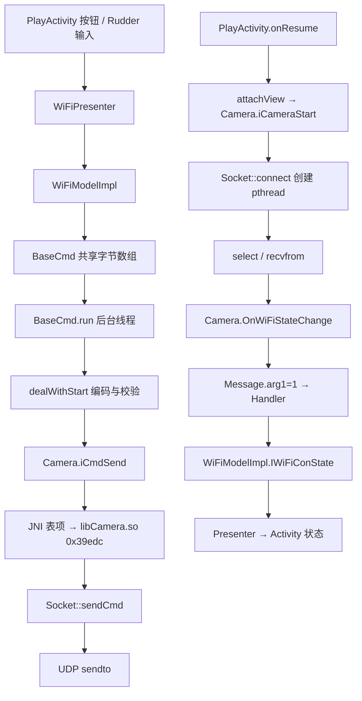

# 调用链与逐边证据

下列链条已由本样本静态代码验证；箭头不表示本次实际运行。类名与完整签名见 [函数索引](functions.md)。Java 层证据 [C01–C06](evidence/java-evidence.json)、[P01–P05](control-protocol.md)；native 地址和指令见 [N](native-analysis.md)。

## 总览



`BaseCmd` 与 UI 间通过共享字段传递参数，并非按钮方法直接调用 `sendto`。图中的接收状态路径不是控制命令 ACK；图像数据到达即可更新界面状态。

## 初始化、启动与停止

| 调用方 | 被调用方 / 异步边 | 参数或条件 | 证据 |
| --- | --- | --- | --- |
| `WiFiApp.onCreate()` | `Camera.iCameraInit()` | 无参数 | C01 原行 106–117 |
| `Camera.iCameraInit()` | native `0x39a78` → `Socket` 构造函数 | JNI 表 `0x71728`；构造调用点 `0x39aac` | N、jni-control.asm |
| `WiFiPresenter` 构造函数 | `new WiFiModelImpl(context,this)` | presenter 作为 Model 回调 | C03 原行 142–161 |
| `WiFiModelImpl` 构造函数 | `new Camera(context,this)` | Model 作为 nativeListener；另建 BaseCmd | C04 原行 20–29 |
| `PlayActivity.onResume()` | `ICmd_Start()` / `ICmd_Resume()` | 按 `bLockClick` 选择 | C02 原行 1437–1443 |
| `PlayActivity.onResume()` | `WiFiPresenter.attachView(this)` | 当前 Activity 是 ICaptureView | C02 原行 1444 |
| `WiFiPresenter.attachView` | 继承的 `BaseModel.iCameraStart()` | wiFiModel 非空，先设置数据监听 | C03 原行 303–310 |
| `BaseModel.iCameraStart()` | `Camera.iCameraStart()` | 无参数 | C05 原行 64–66 |
| `Camera.iCameraStart()` | native `0x39c5c` → `Socket::connect @ 0x334cc` | 调用点 `0x39c74`，对象非空 | N |
| `Socket::connect()` | `pthread_create` → `udpSocketEnterance/cmdSocketEnterance` | GOT 解析两个线程入口；非同步调用入口函数 | N，调用点 `0x33504/0x33520` |
| `udpSocketEnterance` | `socket(2,2,17)` 两次 | 初始化图像与命令 socket | N，`0x33670/0x336f8` |
| `PlayActivity.onDestroy()` | `WiFiPresenter.disattachView()` | 清理视图生命周期 | C02 原行 1501–1508 |
| `WiFiPresenter.disattachView()` | `BaseModel.iCameraStop()` → `Camera.iCameraStop()` | 清监听后停止 | C03、C05 |
| `Camera.iCameraStop()` | native `0x39c8c` → `Socket::disconnect()` | 尾跳点 `0x39c9c`；仅清运行标志 | N |
| `PlayActivity.onDestroy()` | `ICmd_Stop` → Model → `BaseCmd.stop()` | 清 Java 运行标志并 join | C02、P02、P03 |

`WiFiApp.onDestroy()` 中可见 `iCameraDeinit()`，但本次没有证明 Android 系统会自动调用该自定义 Application 方法，不能用它保证进程退出清理。`onPause()` 中也没有发现上述停止调用。

## 控制输入、协议与发送

| 调用方 | 被调用方 / 数据边 | 参数或处理 | 证据 |
| --- | --- | --- | --- |
| layout `android:onClick="onClick"` | `PlayActivity.onClick(View)` | `btnPlayOneKeyFly` / `btnPlayOneKeyLand` / `btnMengencyStop` | P05 资源与 P03 ID 分支 |
| `PlayActivity.onClick(View)` | `WiFiPresenter.ICmd_OneKeyFly/Land/Mergency()` | 按资源 ID 区分按钮 | P03 |
| presenter 对应接口 | `WiFiModelImpl` 同名接口 | wiFiModel 非空 | P03 |
| Model 对应接口 | `BaseCmd.takeOneKeyFly/takOneKeyLand/takeOneKeyMergency()` | baseCmd 非空；设置字段不立即发送 | P01、P03 |
| `PlayActivity.widget_init()` | `mRudder.registerListener(this)` | listener 指向 Activity | P03 |
| `Rudder.dealWithAccRudder` | listener `onAccNotify(int,int)` | 摇杆坐标转换为偏航、动力 | P03 |
| `PlayActivity.onAccNotify` | `ICmd_AccNotify(byte,byte)` → Model → `BaseCmd.onAccNotify` | 交换为动力、偏航，动力保留值修正 | P03、P01 |
| `Rudder.dealWidhDirRudder` | `PlayActivity.onDirNotify` → Presenter/Model → `BaseCmd.onDirNotify` | 横滚、俯仰，经微调/边界处理 | P03、P01、P04 |
| `BaseCmd.start()/resume()` | `new Thread(this).start()` → `run()` | 设置 state=1/0；只在无活跃线程时新建 | P02 |
| `BaseCmd.run()` | `dealWithStart()` / `dealWithResume()` | 按 state 分发并循环 | P02 |
| `dealWithStart()` | `IBaseCmd_Odd/IBaseCmdNew_odd` → `Camera.iCmdSend` | 写校验，传 byte[] 和实际数组长度 | P01、P02 |
| `dealWithResume()` | `Camera.iCmdSend` | 计数达阈值传 snapData[8] | P02 |
| `Camera.iCmdSend([BI)I` | JNI `0x39edc` | 表项 `0x71848` 注册映射；非猜测命名 | N，JNI JSON |
| native `0x39edc` | `Socket::sendCmd @ 0x33f24` | 保留长度并复制 payload；调用点 `0x39f50` | N，PLT `0x63e10` |
| `Socket::sendCmd` | libc `sendto` | cmdSocket fd/地址、payload、长度 | N，调用点 `0x33f80`，PLT `0x63d50` |

## 状态回调与类型选择

| 调用方 | 被调用方 / 异步边 | 参数或机制 | 证据 |
| --- | --- | --- | --- |
| native `C_Method::registerMethod` | JNI `GetStaticMethodID` | `OnWiFiStateChange(I)V` 保存到对象 +0x30 | N，state-callback.asm |
| `udpSocketEnterance` | `select/recvfrom` → `onNotifyWiFiState` | 接收成功状态切换传 1；累计失败路径传 0 | N，`0x337fc/0x338cc` |
| `onNotifyWiFiState` | `Camera.OnWiFiStateChange(int)` | 取同一 method ID，`CallStaticVoidMethod` | N，`0x3311c` |
| `Camera.OnWiFiStateChange` | `sendMessage(1,Integer)` | arg1=1，obj=状态 | C06 原行 206–208 |
| `Camera.sendMessage` | Handler 队列 → `Camera$1.handleMessage` | `mHandler.sendMessage`，异步消息 | C06 原行 121–158 |
| Handler arg1=1 分支 | `INativeListener.IWiFiConState(int)` | listener 由 Model 构造时注入 | C06、C04 |
| `WiFiModelImpl.IWiFiConState` | Presenter `disconnected/connected()` | 状态 0/1 映射 | C04 |
| Presenter 回调 | `PlayActivity.disconnected/connected()` | ICaptureView 指向已 attach 的 Activity | C03、C02 |
| `Camera.OnCameraType(int)` | `sendMessage(3,Integer)` → Handler → Model `ICameraType(int)` | 独立类型回调，不混同连接状态 | C06、C04 |
| Model `ICameraType(int)` | `BaseCmd.setCameraType(int)` | 更新 sendType | C04、P02 |

## 与实现一致的伪代码

```text
UI callback:
  update shared command fields and one-shot flags

Java worker while running:
  if state == START:
    clear expired flags
    select cmdData[8] or cmdNewData[20] by sendType
    write adjusted XOR checksum
    Camera.iCmdSend(array, array.length)
    sleep(40 or 47 ms)
  else if state == RESUME:
    send snapData only when resumeCount >= 25; update counter
    sleep(30 ms)

JNI iCmdSend:
  get Java byte elements; allocate/copy caller_length bytes
  if mSocket exists: Socket.sendCmd(copy, caller_length)
  release buffers
  return 0
```

以上来自此 APK 的具体逻辑，省略了日志和异常分支。共享字段的并发可见性、设备 ACK、实际周期和飞行动作不在静态证据能保证的范围内。
